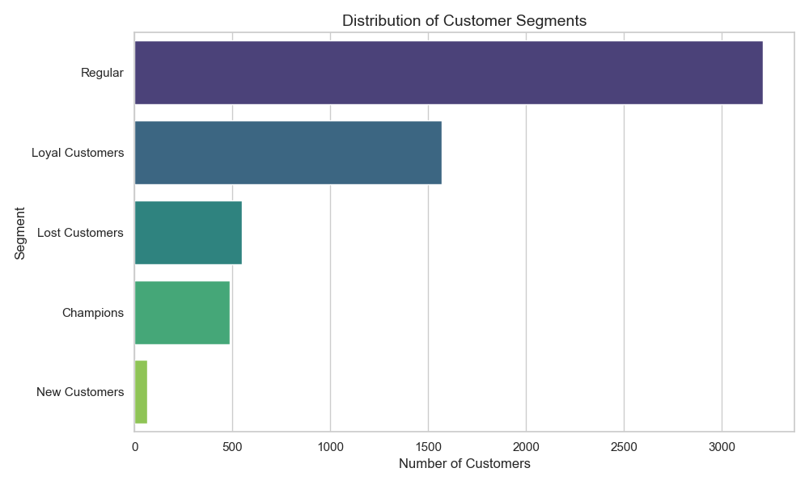
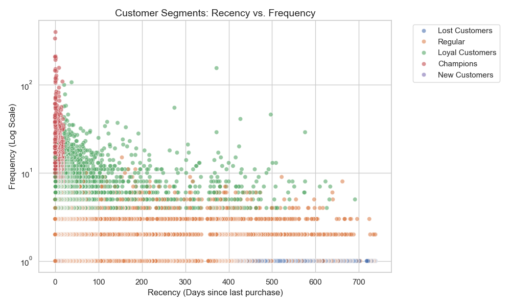

# 🛒 E-Commerce RFM Analysis & Customer Segmentation

## 📌 Business Goal
The objective of this project is to segment customers of a UK-based online retailer using **RFM (Recency, Frequency, Monetary)** analysis. This segmentation allows the marketing team to target specific user groups (e.g., "Champions", "At Risk") with personalized campaigns.

**Dataset:** 2 Years of transactional data (2009-2011).

## 📊 Key Insights & Visualizations

### 1. Customer Segments Distribution
*Most of our user base falls into the "Regular" category, but we identified a strong group of **Champions** and **Loyal Customers** who drive revenue.*


### 2. Recency vs Frequency Analysis
*Champions (in purple/dark) are clustered at the top left: they buy frequently and recently. At Risk customers (in red/orange) buy frequently but haven't been seen in a while.*


## 🛠️ Tech Stack
* **Python (Pandas, Seaborn):** ETL pipeline (Extract, Transform, Load) and Data Visualization.
* **SQL (SQLite):** Advanced data querying using Window Functions (`NTILE`) and CTEs for segmentation logic.

## 🚀 How to Run
1.  **Setup Database:**
    ```bash
    python notebooks/setup_db.py
    ```
2.  **Run Full Analysis Pipeline:**
    ```bash
    python notebooks/run_full_project.py
    ```
3.  **Generate Visualizations:**
    ```bash
    python notebooks/visualization.py
    ```

## 📂 Project Structure
```text
├── data/               # Raw CSVs & SQLite Database
├── notebooks/          # Python ETL & Automation Scripts
├── sql_scripts/        # SQL Queries for RFM Logic
└── images/             # Generated Charts